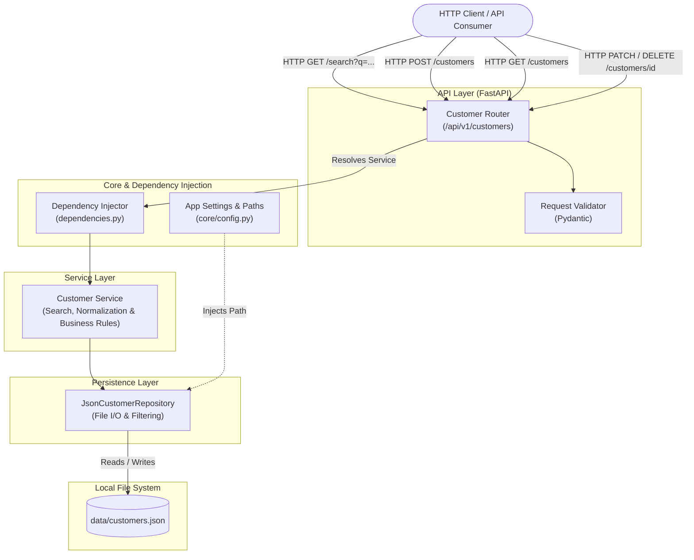
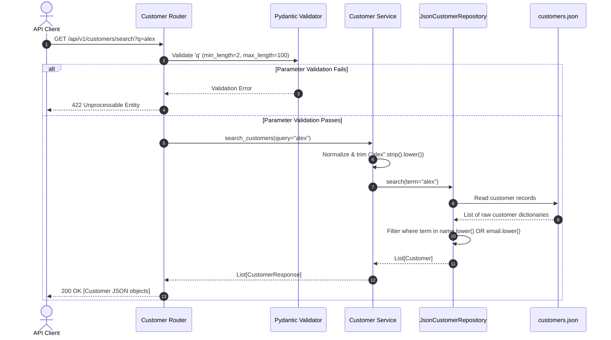

# Architecture

## Overview
The **Customer Search** service is designed following a modular, layered architecture adhering to separation of concerns and Dependency Injection (DI) principles. The system exposes a RESTful API powered by **FastAPI**, with schema validation provided by **Pydantic**, business logic encapsulated in dedicated service components, and a local **JSON-based repository** for data persistence.



---

## Components

1. **API Router (`app/routers/customer_router.py`):** Handles incoming HTTP requests, binds query parameters and request bodies, enforces validation constraints, and returns standard HTTP status codes and JSON payloads.
2. **Schema & Model Definitions (`app/schemas/customer.py`):** Pydantic models for data validation, serialization, and domain contracts (`Customer`, `CustomerCreate`, `CustomerResponse`).
3. **Customer Service (`app/services/customer_service.py`):** Encapsulates core business rules, string normalization (trimming and case-insensitivity), duplicate email validation, and delegates persistence operations.
4. **JSON Customer Repository (`app/repositories/json_customer_repository.py`):** Manages file-system operations (reading, writing, and atomic initialization of the JSON storage file) and performs in-memory substring filtering.
5. **Configuration & Dependency Injection (`app/core/config.py`, `app/dependencies.py`):** Centralizes application configuration and manages component lifecycle and dependency injection.

---

## Responsibilities

| Component | Responsibility |
| :--- | :--- |
| **`CustomerRouter`** | HTTP transport, parameter binding, routing, HTTP response formatting |
| **`Pydantic Schemas`** | Input validation (types, lengths, email format), response serialization |
| **`CustomerService`** | Query normalization, business validation (uniqueness), coordinating repository calls |
| **`JsonCustomerRepository`** | Safe JSON deserialization/serialization, directory and file bootstrapping, collection filtering |
| **`Configuration`** | Storage path management, environment variable loading |

---

## Data Flow

The sequence diagram below illustrates the end-to-end data flow for a search request:



---

## Interfaces

### Repository Interface (`JsonCustomerRepository`)
```python
class JsonCustomerRepository:
    def __init__(self, file_path: Path) -> None: ...
    def get_all(self) -> list[Customer]: ...
    def get_by_id(self, customer_id: str) -> Customer | None: ...
    def get_by_email(self, email: str) -> Customer | None: ...
    def search(self, term: str) -> list[Customer]: ...
    def save(self, customer: Customer) -> Customer: ...
    def update(self, customer: Customer) -> Customer | None: ...  # None if ID not found
    def delete(self, customer_id: str) -> bool: ...                # False if ID not found
```

### Service Interface (`CustomerService`)
```python
class CustomerService:
    def __init__(self, repository: JsonCustomerRepository) -> None: ...
    def search_customers(self, query: str) -> list[CustomerResponse]: ...
    def create_customer(self, customer_in: CustomerCreate) -> CustomerResponse: ...
    def get_all_customers(self) -> list[CustomerResponse]: ...
    def update_customer(self, customer_id: str, customer_in: CustomerUpdate) -> CustomerResponse: ...
    def delete_customer(self, customer_id: str) -> None: ...
```

### HTTP REST Endpoints
* `GET /api/v1/customers/search?q={query}`: Searches customers by partial name or email.
* `POST /api/v1/customers`: Registers a new customer record.
* `GET /api/v1/customers`: Returns all existing customer records.
* `PATCH /api/v1/customers/{customer_id}`: Partially updates a customer's name and/or email.
* `DELETE /api/v1/customers/{customer_id}`: Permanently deletes a customer record.

---

## Error Handling

* **Validation Failures (HTTP 422):** FastAPI and Pydantic automatically intercept malformed queries (missing `q`, length $< 2$ or $> 100$) and invalid body payloads (invalid email format, empty strings), returning standardized error schemas.
* **Not Found Errors (HTTP 404):** `CustomerService` raises `CustomerNotFoundError` when updating or deleting an unknown `customer_id`; the router maps it to 404.
* **Conflict Errors (HTTP 409):** Raised by `CustomerService` (`CustomerAlreadyExistsError`) when an attempt is made to register a customer, or update a customer's email, with an email address already owned by another customer in the JSON file.
* **Storage and Parsing Errors (HTTP 500):** If the JSON file cannot be read or is corrupted, internal exceptions are captured and logged, returning an internal server error response without exposing sensitive stack traces.

---

## Testing Strategy

* **Test Suite Framework:** Built with **`pytest`** and **`httpx`** (`TestClient`).
* **Storage Isolation Fixture:** Tests make use of `pytest`'s built-in **`tmp_path`** fixture to supply a unique, isolated temporary JSON file path to `JsonCustomerRepository` for each test run.
* **Test Layers:**
  * **Unit Tests (`tests/test_json_customer_repository.py`):** Validates repository bootstrap, atomic file read/writes, email search, and substring matching.
  * **Integration Tests (`tests/test_customer_search_api.py`):** Validates HTTP endpoints, parameter trimming, status codes (200, 201, 409, 422), case insensitivity, and response schemas.

---

## Dependencies

* **`fastapi`:** High-performance web framework for building APIs with Python.
* **`uvicorn[standard]`:** Production-ready ASGI web server implementation.
* **`pydantic` & `email-validator`:** Schema definition, data parsing, and RFC-compliant email validation.
* **`pytest`:** Test execution engine.
* **`httpx`:** Async and sync HTTP client for FastAPI integration testing.

---

## Design Decisions

1. **Layered Architecture with Dependency Injection:** Decouples web routing from business logic and storage mechanism. If storage needs to change from JSON to an SQL database in the future, only the repository layer needs modification.
2. **Local JSON File Persistence:** Eliminates infrastructure complexity (no database server or Docker container required), satisfying the project constraints while providing durable storage.
3. **In-Memory Substring Filtering:** Reads the JSON file and performs Python string checks (`term in field.lower()`), ensuring clean case-insensitive partial matching without external indexing engines.
4. **Pydantic v2 Contracts:** Ensures strict type safety, automatic validation, and standardized OpenAPI/Swagger schema documentation.

---

## Trade-offs

* **Local JSON File vs. Relational/NoSQL Database:**
  * *Advantage:* Zero external infrastructure, portable, human-readable file format.
  * *Trade-off:* Does not support distributed multi-process concurrency locks or complex transactional rollbacks. Ideal for small-to-medium datasets.
* **Linear In-Memory Substring Scan vs. Full-Text Search Engine:**
  * *Advantage:* No external search dependencies (e.g., Elasticsearch, Meilisearch); zero setup overhead.
  * *Trade-off:* $O(N)$ linear time complexity relative to the number of records, which is acceptable for typical local file dataset sizes.
